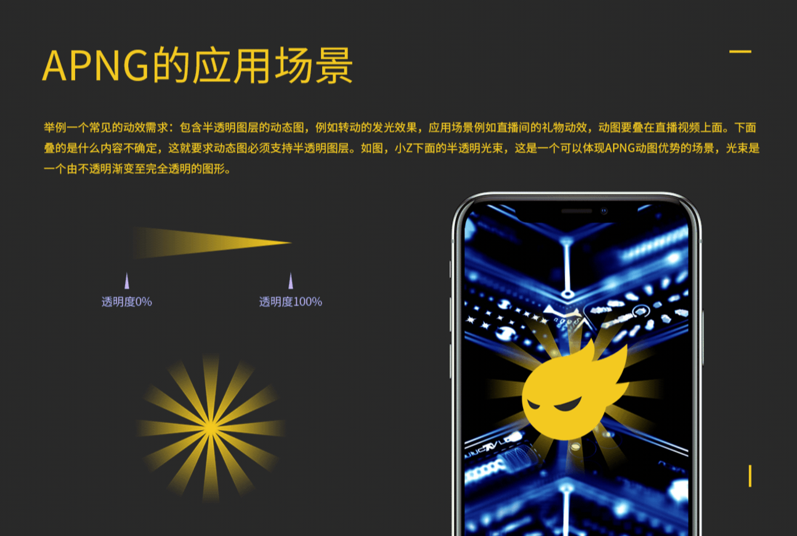
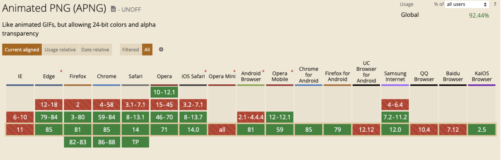

## apng、webp适用性调研与兼容性方案

### 背景

业务中大量使用gif动态图，动画不细腻，体积大，占用不必要的带宽，根据这几点，寻找能替代gif图的方案（动画流程，体积小）

### 动态图类型


#### GIF

GIF 是一个非常古老的格式，1987 年诞生，最后一个版本是 1989 年。（这就是为什么 GIF 文件头的 magic number 是 GIF89a）

**颜色**

GIF 每个像素只有 8 bit，也就是说只有 256 种颜色，于是很多人误以为 GIF 不支持 24 bit RGB，但实际上，GIF 的限制是每一帧最多只能有 256 种颜色，但是每种颜色可以是 24 bit 的。不过即使是这样，256 种颜色还是太少了，这就导致了 GIF 的画质都比较差。

而 APNG 和 WebP 则完全没有这方面的限制。

**透明**

GIF 虽然也支持透明，但不支持半透明，只支持完全透明或者完全不透明。如果把一个边缘是半透明的图片转换成 GIF，就会出现杂边问题。


**兼容性**

是唯一GIF的优势了，几乎所有浏览器都支持GIF

----

#### APNG

**APNG是什么**

APNG 是什么？相对于 GIF 有哪些优势？APNG 是一个基于 PNG 格式的位图动画格式图片，因为对于一直以来的特点就是以动态显示为主的 GIF，为了更好地在网络上传播，它需要牺牲质量来降低体积，图像信息比较多的情况下，颗粒感很明显。APNG 是普通 png 图片的升级版，它的后缀依然是.png，包含动态的情况下体积会比普通静态 png 打出数倍，可以做到无损的情况展示动态。其诞生的目的是为了替代老旧的 GIF 格式，但它目前并没有获得 PNG 组织官方的认可。

**APNG应用场景**



[GIF VS APNG](http://littlesvr.ca/apng/gif_vs_apng.html)

**兼容性**


[详情兼容情况](https://caniuse.com/?search=APNG)
对于 APNG 而言，支持的浏览器只有 Firefox 和 Safari，同时 Chrome 59 也将支持 APNG，

**对比**

GIF：

最多支持 8 位 256 色，色阶过渡糟糕，图片具有颗粒感
不支持 Alpha 透明通道，边缘有杂边
APNG：

支持 24 位真彩色图片
支持 8 位 Alpha 透明通道
向下兼容 PNG


**缺点**
* 很难被标准化
* 生成比较繁琐（特殊处理才能比原有GIF图体积大，在压缩上并没有webp效果好,参考动效输出：用APNG代替GIF完美输出动态效果）


------

##### WEBP

先放一个 WebP 转换的示例链接，可以直观感受 WebP 在图片大小上的优势。

[DEMO地址](https://www.upyun.com/webp)

WebP，是一种同时提供了有损压缩与无损压缩的图片文件格式，派生自视频编码格式 VP8。WebP 最初在2010年发布，目标是减少文件大小，但达到 和 JEPG 格式相同的图片质量，希望能够减少图片档在网络上的发送时间


**同等质量但是图片更小**

[GIF图](https://res.cloudinary.com/demo/image/upload/bored_animation.gif)

[webp](https://res.cloudinary.com/demo/image/upload/fl_awebp/bored_animation.webp)

从动画GIF切换到动画WebP的结果令人印象深刻-在上面显示的示例中，图像大小和带宽减少了65-90％，并且具有相同的视觉效果。尽管WebP仅由少数浏览器使用，但是最新版本的Chrome变得越来越流行，因此WebP的重要性正在上升。

此外，如果将原始的高质量视频转换为WebP（而不仅仅是像我们在上面的示例中那样从GIF转换为WebP），则与WebP格式的全彩色支持相比，您将获得更好的视觉效果动画(GIF中最多只能显示256种颜色。)

**压缩之后质量无明显变化**
JPEG 格式的图片在质量较低时会有明显的缺陷，尤其是当图片包含微小的细节或文本时，但 WebP 格式则没有明显的缺陷，但也会在低质量设置时产生稍微模糊的图像

**完美支持无损图像**
WebP 同样支持一如 PNG 格式的无损模式，想要生成无损的 WebP 文件，只需将「quality」变量设置为 100

**支持动态图（Animated WebP）**

兼容性不是很乐观

苹果的Safari浏览器及其iOS Safari浏览器将在Safari 14和iOS 14（预计于2020年9月发布）中都具有WebP支持


**缺点：浏览器兼容性**


在洋葱学院APP中存在了兼容问题:
1.安卓暂时未发现不兼容问题
2.ios 系统存在版本兼容问题（12.x系统上就存在了不兼容情况）

**兼容场景：**

[WEBP兼容地址](https://caniuse.com/?search=Webp)
[picture兼容地址](https://caniuse.com/?search=picture)

* 解决兼容：
* 七牛提供了高级图像处理的功能
* 通过URL后拼接参数，能把gif图处理成webp
* 1.安卓下七牛CDN借用高级图像处理功能form成webp（IOS维持GIF图原样）
* 2.JS判断是否支持webp如果支持，把gif图通过七牛处理成webp动态图，不支持维持原样。
* 
HTML5标签 picture,是一套精简的兼容方案，浏览器兼容可通过此标签来展示对应的图片

```
    ​<picture>
      <source srcset="https://dn-odum9helk.qbox.me/test.gif?imageMogr2/thumbnail/100x|imageMogr2/format/webp" type="image/webp" />
      
    </picture>
```


**应该用webp嘛？**

由于WebP在全球范围内的支持率徘徊在80％左右，因此使用此图像格式替代PNG和JPEG在很大程度上很有意义。需要特别注意的是，无论如何实现WebP，您都只是向支持WebP的浏览器提供WebP图像，然后将默认格式（如PNG和JPEG）提供给其他浏览器。使用WebP不会破坏图像。可以将其视为增加而不是更改。与PNG和JPEG相比，还需要考虑其他一些因素，例如浏览器市场份额，当前流量和WebP文件大小。


-----


**参考文章：**

[客户端上动态图格式对比](https://dreampiggy.com/2017/03/06/%E5%AE%A2%E6%88%B7%E7%AB%AF%E4%B8%8A%E5%8A%A8%E6%80%81%E5%9B%BE%E6%A0%BC%E5%BC%8F%E5%AF%B9%E6%AF%94%E5%92%8C%E8%A7%A3%E5%86%B3%E6%96%B9%E6%A1%88/)


[Animated WebP - how to convert animated GIF to WebP and save up to 90% bandwidth](https://cloudinary.com/blog/animated_webp_how_to_convert_animated_gif_to_webp_and_save_up_to_90_bandwidth)


[动效输出：用APNG代替GIF完美输出动态效果](https://www.zcool.com.cn/work/ZMjgyNjA2NjQ=.html)


[APNG的那些事](https://aotu.io/notes/2016/11/07/apng/index.html)